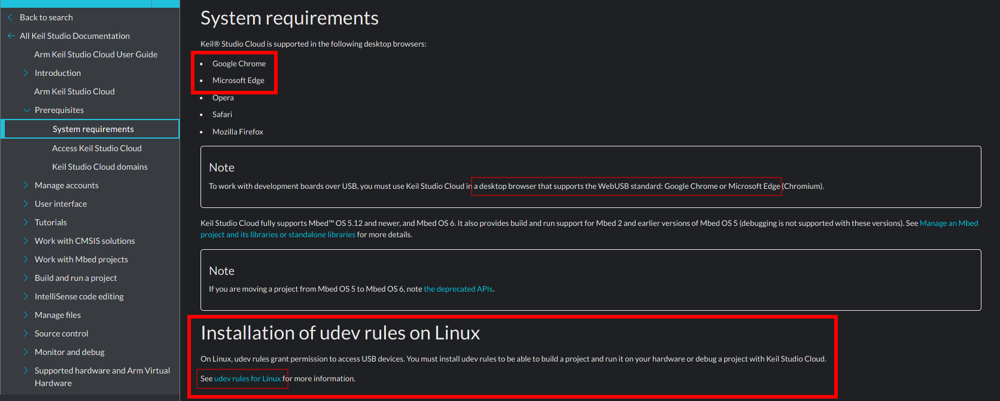
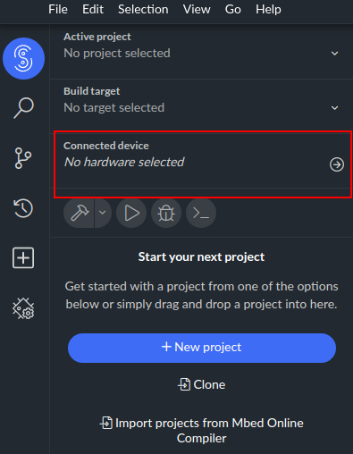
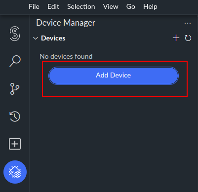
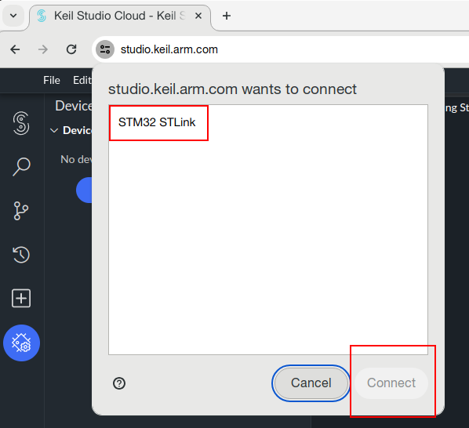
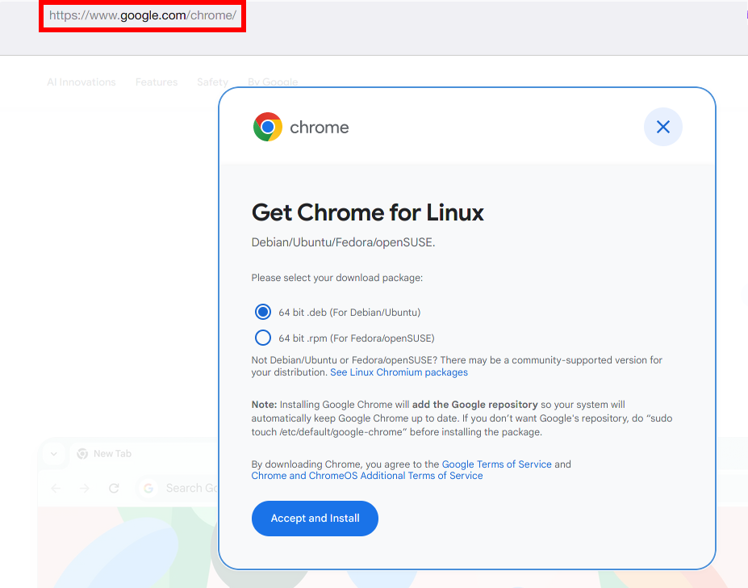

# Debugging con Keil Studio Cloud

Antes de instalar una herramienta de desarrollo (o cualquier otra pieza de software), debemos observar los [requerimientos del sistema](https://developer.arm.com/documentation/102497/1-7/Prerequisites/System-requirements)



Allí observamos que no podemos usar cualquier navegador sino aquéllos que permiten acceso al API USB.

Sugerimos de manera enfática el uso de Google Chrome, a fin de que los profesores puedan ayudar. Nada te impide usar otro de tu agrado, pero no podremos ayudarte si no funciona.

Las respuestas a tus dudas se suelen resolver consultando la [Guía del usuario](https://developer.arm.com/documentation/102497/1-7/)

[Nos conectamos a Keil Studio Cloud](https://studio.keil.arm.com/)

Una vez que ingresamos con nuestras credenciales de Arm o MBed, observamos un menu:



Allí vamos a ver los dispositivos que ya hayamos conectado. Como no hay ninguno, abrimos:



y seleccionamos "agregar".

Luego, veremos los dispositivos disponibles y seleccionamos nuestra placa:



Si no aparece en este listado es porque:

- no tenemos la placa conectada. Se recomienda conectarla antes de iniciar el navegador.
- no prestamos atención y estamos utilizando un navegador no soportado
- estamos usando Linux y debemos configurar correctamente los permisos de acceso a dispositivos USB (_udev_). Esto no debería ocurrir si instalamos el navegador como se indica.

La próxima vez que ingresemos, si la placa está conectada, la vamos a ver en el primer menú.

## Google Chrome

Lo vamos a instalar desde [la página de instalación de Google](https://chrome.google.com/).
Recomendamos no usar Chromium, un _snap_, un _appimage_, un container Docker, o cualquier otra forma de optimizar el espacio en disco, porque en ese caso no podremos dar soporte.

### Linux

En la página de instalación vemos que hay 2 versiones: una para derivados de Debian como Ubuntu, y otra para derivados de Red Hat como Fedora.



De aquí vamos a obtener un archivo `deb` en el primer caso, y un `rpm` en el segundo. Luego de leer y entender lo que dice en la pantalla que mostramos, vamos a proceder a instalar manualmente el navegador.

Esto debería ser suficiente e instalar los permisos correspondientes para poder acceder a la placa de desarrollo por el puerto USB.
En caso de haber inconvenientes, en la guía del usuario de Studio Cloud, como hemos marcado en la primera imagen, nos guía a dónde encontrar información para operar sobre los permisos de acceso a los dispositivos (_udev_)

#### Debian

Abrimos una terminal y nos posicionamos donde hayamos descargado el archivo `deb`.

```sh
$ sudo apt update
$ sudo apt install ./google-chrome-stable_current_amd64.deb 
$ google-chrome
```

#### RPM-based

Abrimos una terminal y nos posicionamos donde hayamos descargado el archivo `rpm`.

```sh
$ sudo dnf localinstall google-chrome-stable_current_x86_64.rpm
$ google-chrome
```
